# Lead Management System

A **Lead Management System** built with **Django** and **Tailwind CSS** for managing sales leads efficiently. The system provides a **dashboard** for tracking leads, assigning them to users, monitoring progress, and analyzing conversion rates.

---

## Features

### Dashboard
- Overview of leads: **New**, **In Progress**, **Converted**, **Lost** with numbers.
- Summary of lead **sources**.
- Admin/Manager can **create and assign leads** to Sales Executives or Managers.
- Filter leads and generate reports:
  - Conversion Rate
  - Overview
  - Source of leads

### User Management
- Register **Admin**, **Manager**, **Sales Executive** accounts.
- Profile section with:
  - Name and bio
  - Profile picture
  - Change password
- Login with **toggle theme** (Light/Dark)
- Forget password via **email OTP** (Mailhog background task)

### Lead Management
- Create, edit, comment on leads
- Filter leads and track **status changes**
- Logs for actions:
  - Login / Logout
  - Viewed profile
  - Created / Deleted / Viewed leads
  - Accessed dashboard

---

## Screenshots

### Dashboard & Leads
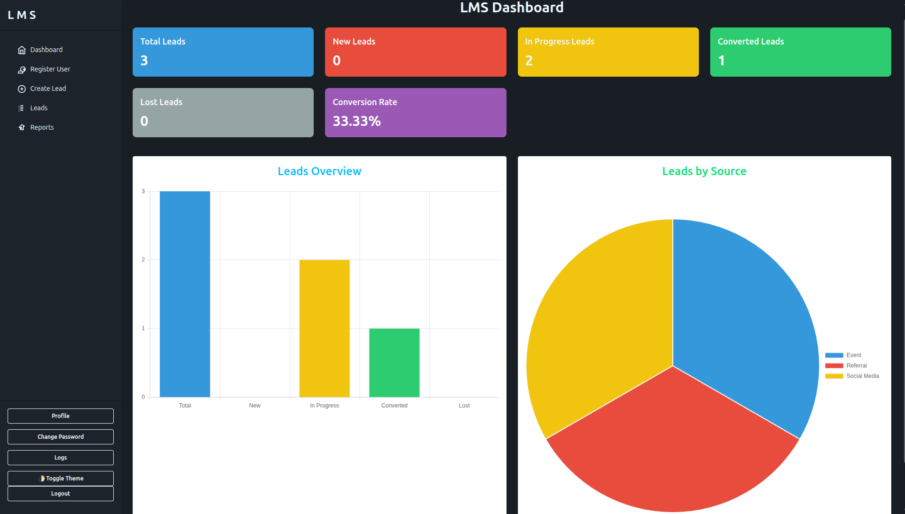
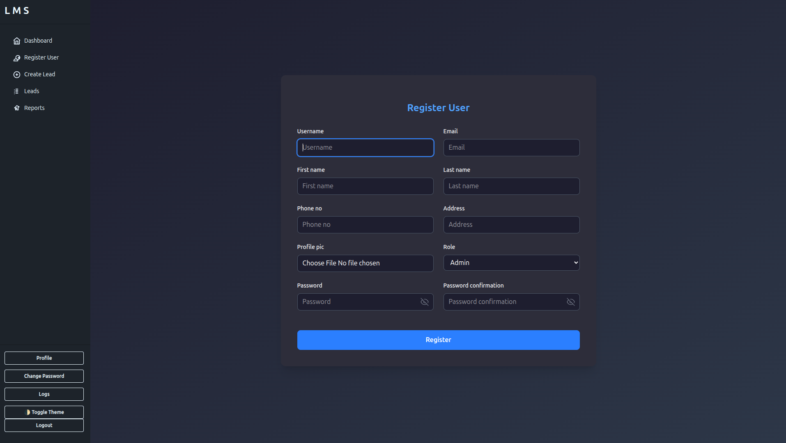
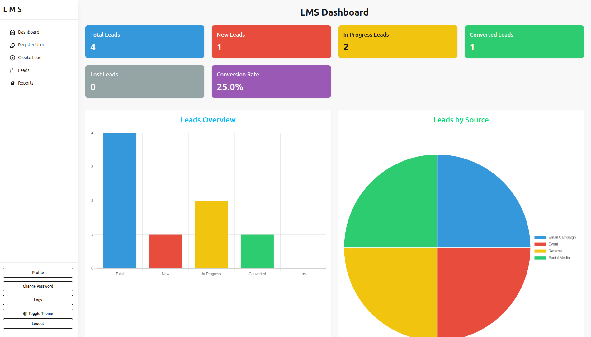
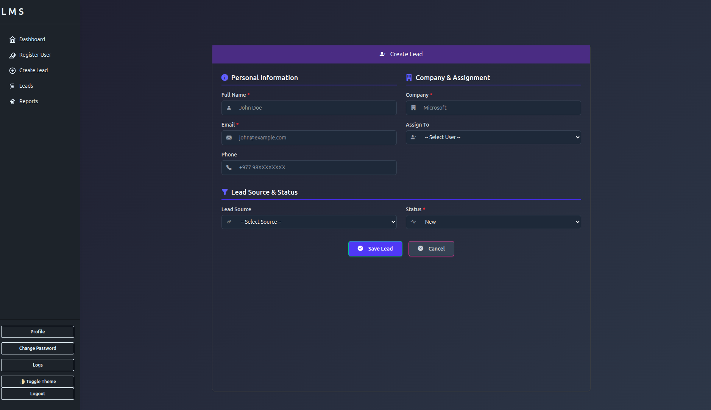
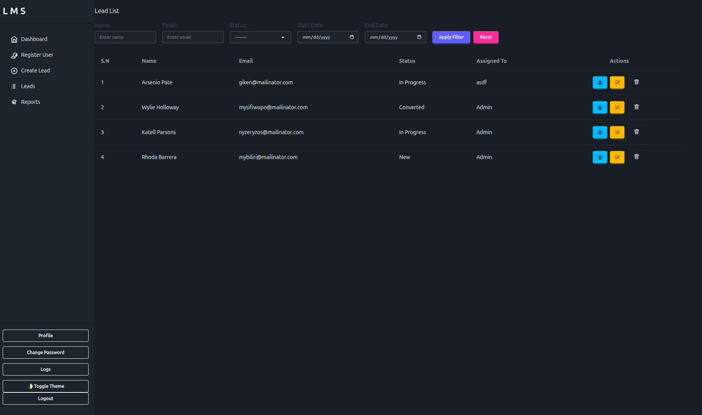
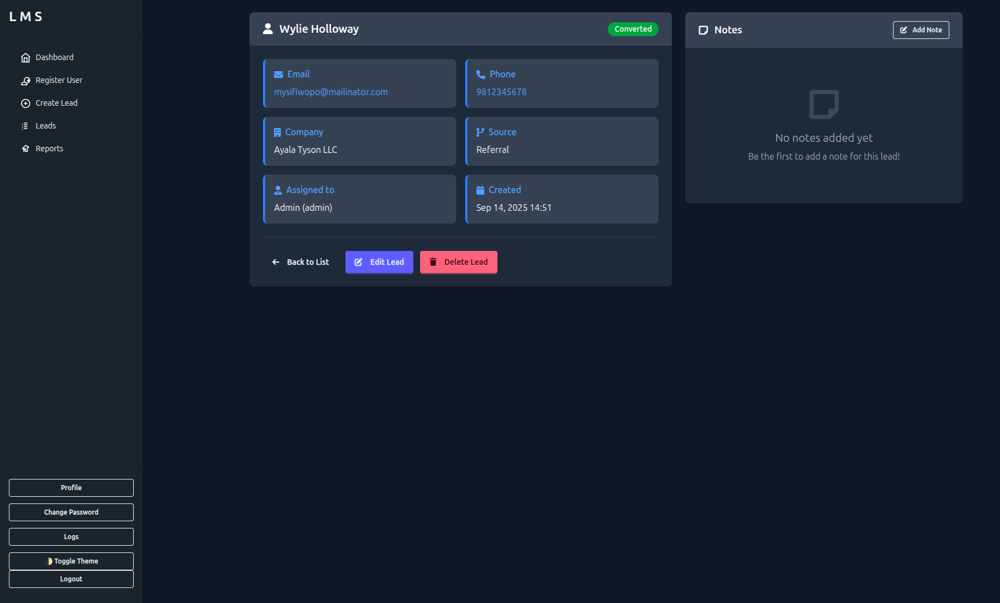
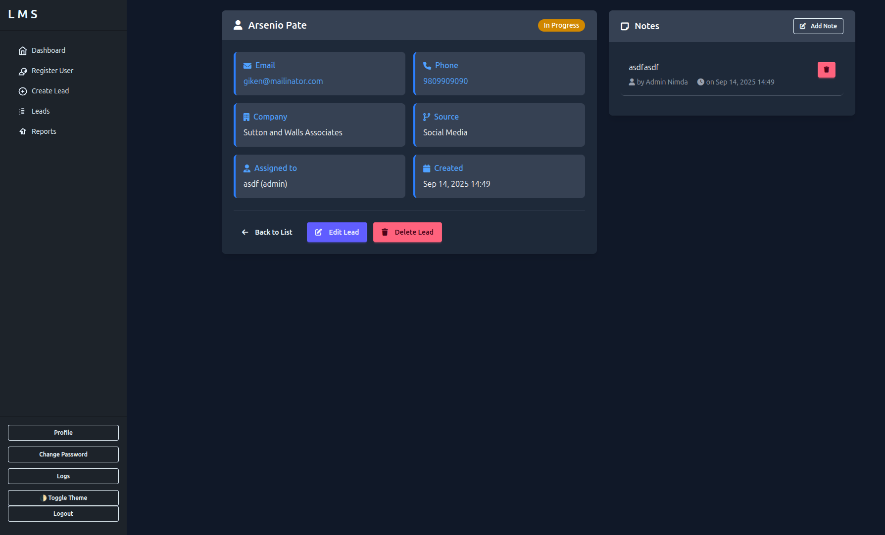
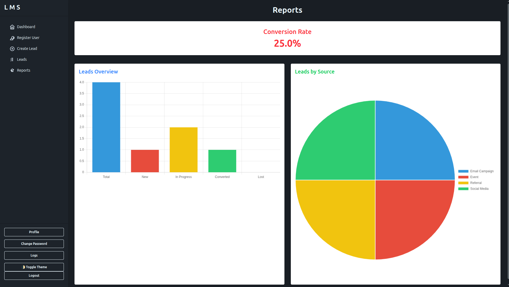
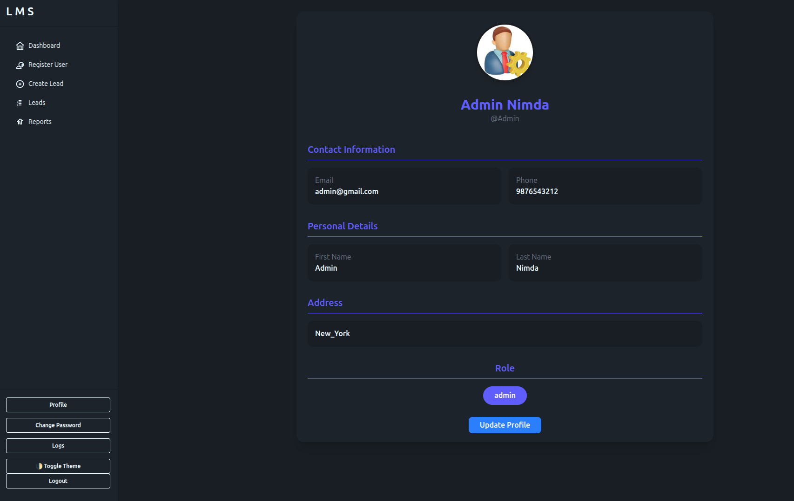
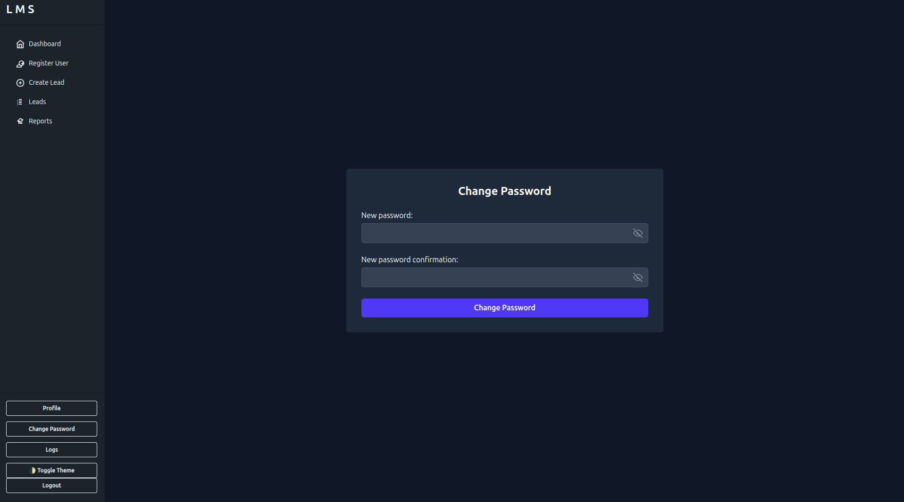
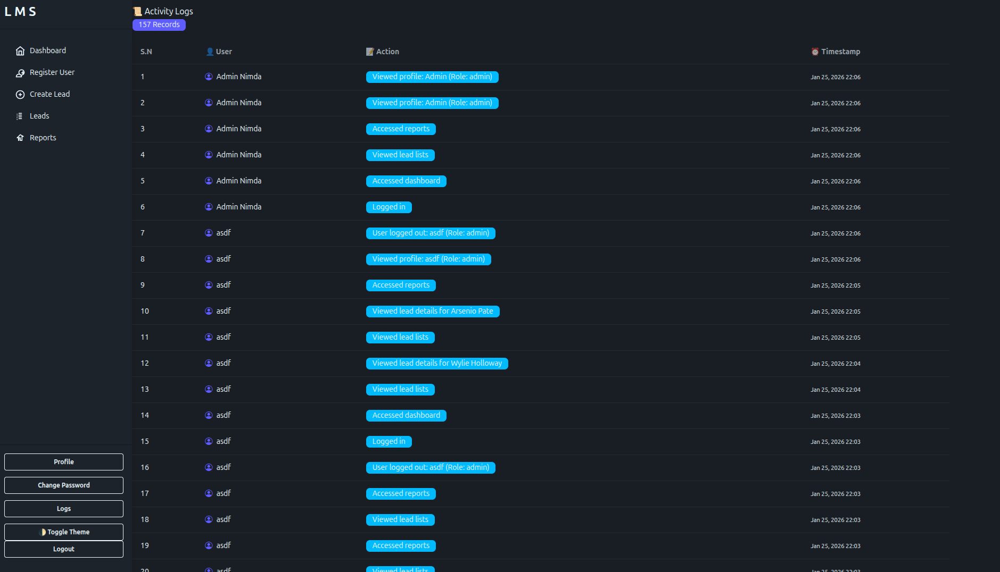
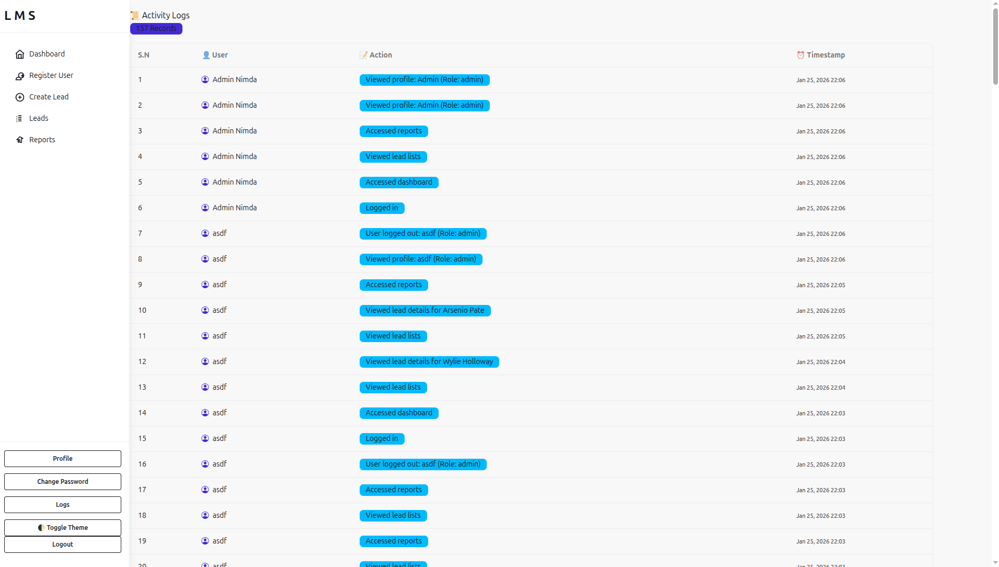

---

## Tech Stack

- **Backend:** Django  
- **Frontend:** Tailwind CSS, HTML, JavaScript  
- **Database:** SQLite (replaceable with PostgreSQL later)  
- **Email Testing:** Mailhog for OTPs  

---
# 🚀 Lead Management System - Installation Guide

# 1. Clone the Repository
git clone https://github.com/sameer9860/Lead-Management-System.git

cd Lead-Management-System

# 2. Create Virtual Environment
python -m venv env

# 3. Activate Virtual Environment
# Windows (PowerShell)
.\env\Scripts\activate
# windows(CMD)
env\Scripts\activate
# macOS/Linux
source env/bin/activate

# 4. Install Dependencies
pip install -r requirements.txt

# 5. Apply Database Migrations
python manage.py migrate

# 6. Create Superuser (Admin)
python manage.py createsuperuser
# 👉 Follow the prompts to set up your admin account

# 7. Run Development Server
python manage.py runserver

# 8. Run Tailwind Server
python manage.py tailwind start 

# 9.Run Tailwind and django server at once 
python manage.py tailwind dev

# 10. Access the Application
# Open your browser and go to:
# http://127.0.0.1:8000

